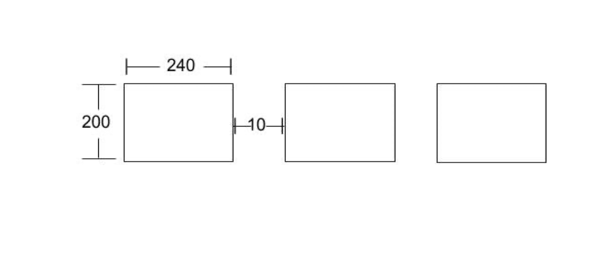
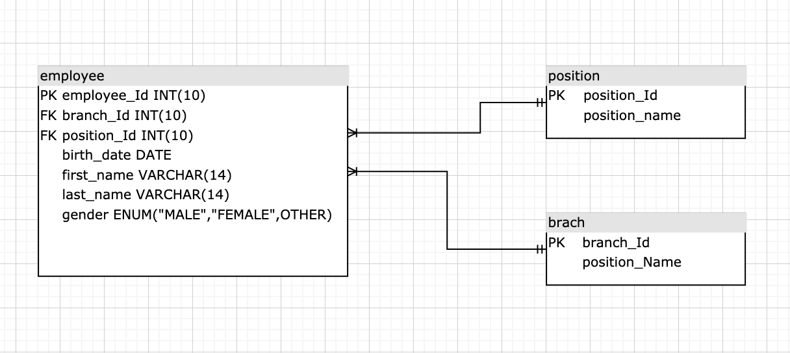

# PHP PROGRAMER TEST

## 1. (ทดสอบ Loop) จงเขียนโปรแกรมให้ แสดงดังภาพต่อไปนี้ ( ใช้ภาษา PHP และวงกลมในรูปคืออักษร O )

### 1.1

> **answer:**
>
> ```php
> function renderO($dimension) {
>     for ($x = 0; $x < $dimension; $x++){
>         $checkPrintOIndex = $dimension - 1 - $x;
>       for ($y = 0; $y < $dimension; $y++){
>         echo $y >= $checkPrintOIndex ? "o": "&nbsp&nbsp";
>       }
>       echo "<br>";
>     }
>   }
> renderO(5);
> ```

### 1.2

> **answer:**
>
> ```php
> function renderOCenter($height) {
>     $yLength = $height + ($height - 1);
>    for ($x = 0; $x < $height; $x++){
>         $minIndex = $height - $x -1;
>         $maxIndex = $height + $x -1;
>         $contY = 0;
>         for ($y = 0; $y < $yLength; $y++){
>             echo $y >= $minIndex && $y <= $maxIndex ? "o": "&nbsp&nbsp";
>         }
>         echo "<br>";
>     }
> }
> renderOCenter(5);
> ```

````

## 2. (ทดสอบความเข้าใจ if, else)

### 2.1 มีเงิินเดือน 10,000 บาท เดือนนี้จะได้เงินเดือนเท่าไหร่ หากมีเงื่อนไขดังนี้

```php
if($salary < 10000){
    $salary = $salary +  200;
}elseif($salary < 11000){
    $salary  += 200;
} elseif ($salary < 12000){
    $salary  += 300;
}
````

> **answer:** 10,200 บาท

### 2.2 (ทดสอบ short if) จากข้อมูลที่ให้มาข้่างล่าง Output คืออะไร

#### 2.2.1

```php
$bath = 100;
echo ($bath==300? "300":"200")
```

> **answer:** 200

#### 2.2.2

```php
$score = 9;
$age= 10;
echo "Your Score is : ". $score > 10 ? (age >10 ? "Average" : "Exceptional") : ($age >10 ? "Horible": "Average");
```

> **answer:** "Average"

## 3. (ทดสอบ foreach)

### 3.1 หากวนลูป echo เฉพาะ Value และใช้เงือนไขข้อ 2.1 โดยใช้ value แทน Salary จะได้ค่าอะไรบ้าง

> **answer:**
>
> ```php
> $data = array(
>     10000 => 15000,
>     15000 => 20000,
>     "salary" => 30000,
> );
> ```

#### answer 1500, 20000 และ 30000 ตามลำดับ

### 3.2 (ทดสอบ อาร์เรย์หลายมิติ Multidimensional array)

> **answer:**
>
> ```php
> $mark = array(
>     "mohammad" => array(
>         "physical" => 35,
>         "maths" => 30,
>         "chemistry" => 39
>     ),
>     "qadir" => array(
>         "physical" => 30,
>         "maths" => 32,
>         "chemistry" => 29
>     ),
>     "zara" => array(
>         "physical" => 31,
>         "maths" => 22,
>         "chemistry" => 39
>     )
>     );
> ```

#### 3.2.1 Output 35 มาแสดงจะต้องเขียน code อย่างไร

#### answer

> **answer:**
>
> ```php
> echo $mark[mohammad][physical];
> ```

#### 3.2.2 Output 35 30 39 30 32 29 31 22 39 มาแสดงจะต้องเขียน code อย่างไร

> **answer:**
>
> ```php
> foreach ($mark as $keyUser => $user) {
> 	foreach ($user as $keySubject => $subjectValue) {
> 		echo "{$subjectValue} ";
>     }
> }
> ```

## 4. (ทดสอบ html และ CSS) เขียน html และ css ดังภาพต่อไปนี้ (วางโครงสร้างให้ดีที่สุด)



> **answer:**
>
> ```html
> <div class="container">
>   <div class="box"></div>
>   <div class="box"></div>
>   <div class="box"></div>
> </div>
> ```
>
> ```css
> .container {
>   display: flex;
>   flex-direction: row;
>   justify-content: center;
> }
> .box {
>   width: 240px;
>   height: 200px;
>   border: 1px solid black;
>   margin: 0 5px;
> }
> ```

## 5. (ทดสอบการออกแบบฐานข้อมูลด้วย ER Diagram และเขียน sql) เครือบริษัท Master-programmer มีพนักงานทั้งหมด 400 คน มีตำแหน่งหลายตำแหน่งและมีสาขาอยู่มี่จังหวัดกรุงเทพ ระยแง เลย และ ปัตานี

### 5.1 ออกแบบฐานข้อมูลให้เหมาะสมกับโจทย์ข้างต้นโดยแสดงในรูปแบบ ER Diagram

> **answer:**
>
> 

### 5.2 ต้องการเพิ่มสาขาที่จังหวัดเชียงใหม่ เชียงราย และ ภูเก็ต

> **answer:**
>
> ```sql
> INSERT INTO `aegistha_shippop`.`branch` (`branch_id`, `branch_name`) VALUES (NULL,  'เชียงใหม่'), (NULL, 'เชียงราย'), (NULL, 'ภูเก็ต');
> ```

### 5.3 ต้องการลบตำแหน่ง sale

> **answer:**
>
> ```sql
> DELETE FROM `position` WHERE `position_name` = 'sale'
> ```
>
> \*\*\*\* เนื่องจากเป็นการทดสอบ sql พื้นฐานจึงทำการลบข้อมูล แต่ในงานจริงจะทำการ soft delete แทน

### 5.4 ต้องการแก้ไขสขาปัตตานี เป็น นราธิวาส

> **answer:**
>
> ```sql
> UPDATE `branch` SET `branch_name`='นราธิวาส' WHERE `branch_name`='ปัตตานี';
> ```

### 5.5 ต้องการแก้แสดงข้อมูลพนักงานบริษัท Master-progammer ทั้งหมด 400 คน

> **answer:**
>
> ```sql
> SELECT *
> FROM `employee`
> ```

### 5.6 ต้องการแก้แสดงข้อมูลพนักงานบริษัท Master-progammer ที่อยู่ในสาขาระยองและ กรุงเทพ

> **answer:**
>
> ```sql
> SELECT *
> FROM `employee`
> INNER JOIN `branch` ON employee.branch_id = branch.branch_id
> WHERE branch.branch_name = 'กรุงเทพ'
> OR branch.branch_name = 'ระยอง'
> ```

### 5.7 ต้องการแก้แสดงข้อมูลพนักงานบริษัท Master-progammer ที่อยู่สาขาเลขและมีตำแหน่งเป็น programmer

> **answer:**
>
> ```sql
> SELECT *
> FROM `employee`
> INNER JOIN `position` ON employee.position_id = position.position_id
> INNER JOIN `branch` ON employee.branch_id = branch.branch_id
> WHERE position.position_name = 'programmer' AND branch.branch_name = 'เลย'
> ```

### 5.8 ต้องการแก้แสดงข้อมูลพนักงาน โดยมีข้อมูล สาขา และตำแหน่งของพนักงานแต่ล่ะครในบริษัท master-programmer ทั้งหมด

> **answer:**
>
> ```sql
> SELECT *
> FROM `employee`
> INNER JOIN `position` ON employee.position_id = position.position_id
> INNER JOIN `branch` ON employee.branch_id = branch.branch_id
> ```

## 6. ทำไมถึงอยากเป็นโปรแกรมเมอร์

> **answer:** \
> อยากเป็นโปรแกรมเมอร์เพราะ ได้สร้างส่ิงที่มีประโยชน์ให้ผู้คนในปัจจุบัน และได้เรียนรู้เทคโนโลยีใหม่ๆตลอดเวลาทำให้เราเป็นคน Active อยู่เสมอ

## 7. ถ้ามีปัญหาติดขัดในการเขียนโปรแกรมจะทำอย่างไร

> **answer:**
>
> - search keyword ปัญหาที่เจอ ใน google
> - ถ้าติดนานเกิน 1.ชม ค่อยถามคนอื่นในทีม

## 8.อธิบายการทำงานในรูปแบบ MVC มาพอสังเขป

> **answer:** \
> คือ design pattern รูปแบบหนึ่งของการสร้าง software แบ่งออกเป็น 3 ส่วนตามตัวย่อ MVC ได้ดีงนี้
>
> - M : ย่อมากจาก Model ทำหน้าที่จัดการกับ Database โดยตรง
> - C : ย่อมาจาก Controller ทำหน้าที่รับคำสั่งจาก View ที่ user เพื่อสั่งให้ Model ทำงาน
> - V : ย่อมากจาก View ทำหน้ารับคำสั่งจาก User
>
> ข้อดีของ MVC คือ แยกส่วนในการทำงานของ Software ออกเป็นส่วนๆ ทำให้เมื่อมี่ส่วนได้ส่วนหนึ่งพังส่วนๆอื่นๆยังสามารถทำงานได้

## 9.อธิบายการทำงาน GIT ยกตัวอย่าง GIT มา 3 เว็บ

> **answer:** \
> GIT คือ ระบบ Version Controll ที่สามารถเปรียบเทียบข้อมูลใน file ที่ถูกเปลี่ยนแปลงในแต่ล่ะครั้งได้โดยการบันทึการเปลี่ยนแปลงนั้นใช้ keyword "commit" และ Feature ที่มีประโยชน์สำหรับงานได้ Software Develope มันคือ Git สามารถสร้าง "Branch" เพื่อให้ developer ที่อยู่ใน team แยกกันทำ feature ที่ตัวเองรับผิดชอบได้อย่างอิสระ และเมื่อทำ feateue เสร็จสิ่้น สามารถ "merge" code ของ feature กลัับไปรวมกับ Code ปัจจุบันได้ \
> \
> ตัวอย่าง
>
> - Github
> - BitBucket
> - Gitlab

## 10. อธิบายการทำงานของ Docker

> **answer:** \
> Docker คือ Technology ที่จำลอง สภาพแวดล้อมในการพัฒนาและติดตั้งซอฟแวร์โดยการทำงานของ Docker จะทำการ pull "Docker Image" เพื่อจาก "Docker Container" ที่มี Application รันอยู่ภายใน และ run application ใน Docker Engine

## 11. อธิบายการทำงานของ Compose

> **answer:** \
> เป็น Package Management สำหรับ PHP ทำงานคล้ายกลับ NPM ในภาษา Javascript

## 12. อธิบายการทำงานของ PrePros (Scss)

> **answer:** \
> เป็นเครื่องมือแปลง Scss ไปเป็น css โดยสามารถ minify css ได้ด้วย

## 13. ในเวลาที่เราอยู่เรียนมหาลัย จะมีคนเก่งอยู่ในห้องทั้งหมดกี่คน

> **answer:** \
> ประมาณ 10 คน

## 14. เคยทำ Freelance มาก่อนหรือไม่ (ถ้ามีแนบไฟล์ หรือ เว็บงานที่เคยทำ)

> **answer:** \
> เคยครับ ยังไม่ได้ deploy แต่รันให้ให้ดูได้ถ้าได้สัมภาษณ์

## 15. เคยใช้ Framework อะไรมาบ้างและบอกเหตุผลที่เลือกใช้

> **answer:**
>
> - front-end: ใช้ React เพราะ มีการเขียนแบบ Component-Based ทำให้ Reuse Code
> - back-end: ใข้ Express.js ทำในส่วนของ API เพราะสามารถ สร้าง Middlewares ได้และมี third-party pagkage ให้เลือกใช้เยอะทำให้ลดเวลาในการทำงานได้

## 16. Google Page Speed คืออะไร เคยใช้หรือไม่

> **answer:** \
> คือ tool ที่ใข้วัด Performance ของ website และสามารถบอกถึงจุดบกพร่องของ webiste เพื่อนำไปปรับปรุงได้ ส่วนตัวไม่ได้เพราะทำ ui ให้ function ทำงานได้ และจะมี front-end developer อีกคนรับไปปรับส่วนของ ความสวยงามและ performance

## 17. การทำ On Page Seo ทำอย่างไร

> **answer:**
>
> - ใส่ keyword ใน 100 ถึง 150 คำแรก
> - ใส่ keyword ใน title (h1)
> - ใส่ keyword ใน subtitle (h2)
> - ใส่ keyword ลงไปใน content ของ website
> - ตั่งชื่อ link ของ content ให้กระชับและมี keyword อยู่ในนั้น

```

```
